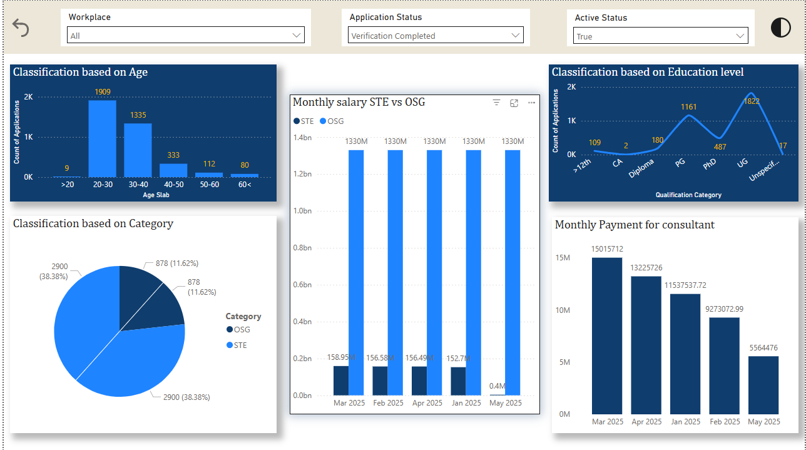
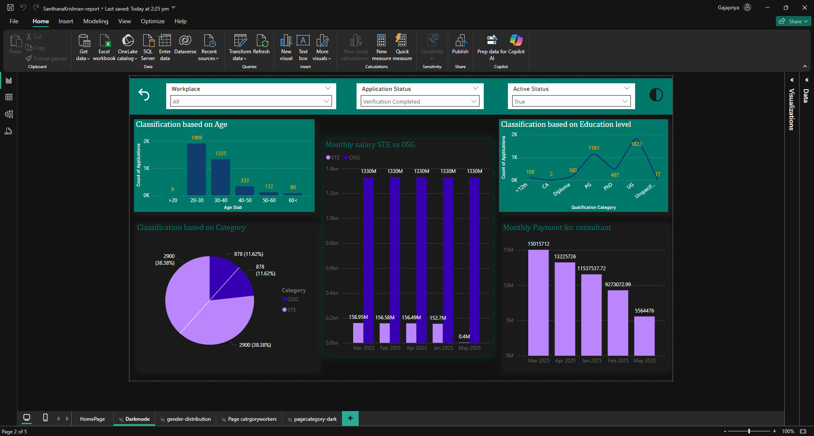

# Consultant Payment  Dashboard

## 📊 Overview
This interactive dashboard provides insights into:
- Age and Education level classification
- Category-wise distribution (OSG vs STE)
- Monthly salary trends (STE vs OSG)
- Consultant payments over time

## 🛠️ Built With
- Power BI 
- Data source: Internal staff salary and consultant application data from kaggle

## 🔍 Key Features
- Dynamic filters (Workplace, Application Status, Active Status)
- Visual storytelling with age, education, and category comparisons
- Monthly trend and classification breakdowns
- used automatic refresh using powerbi workspace
- custom tooltips

## 📁 Files
- `dashboard.png`: Image preview
- `dashboard.pbix`: Power BI file
